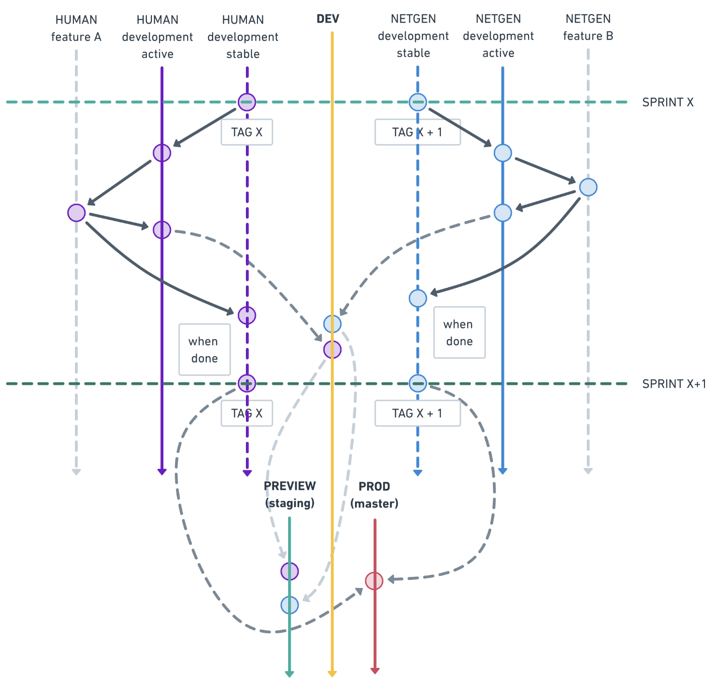

<p align="center"></p>

 
# Sunshine

**STATUS:** Shitty first draft *(last updated 13.12.2019.)*

## Table of contents
- [Introduction](#introduction)
    - [What is monorepo?](#what-is-monorepo)
    - [Monorepo examples](#monorepo-examples)
    - [Previous discussions](#previous-discussions)
- [Technologies used](#technologies-used)
    - [Webpack](#webpack)
    - [Babel](#babel)
    - [Node Version Manager](#node-version-manager)
    - [Storybook](#storybook)
    - [Lerna](#lerna)
    - [Yarn Workspaces](#yarn-workspaces)
- [Code hygiene](#code-hygiene)
    - [ESLint](#eslint)
    - [Stylelint](#stylelint)
    - [Prettier](#prettier)
    - [Remark](#remark)
    - [EditorConfig](#editorconfig)
    - [Husky](#husky)
- [Folder structure](#folder-structure)
- [Getting started](#getting-started)
    - [Requirements](#requirements)
        - [Essential skillset](#essential-skillset)
        - [Environment](#environment)
    - [Environment setup](#environment-setup)
        - [Mac](#mac)
        - [Linux](#linux)
        - [Windows](#windows)
        - [OS agnostic](#os-agnostic)
    - [Project setup](#project-setup)
        - [Clone the repository](#clone-the-repository)
        - [Install dependencies](#install-dependencies)
        - [Use scripts to run or build the project](#use-scripts-to-run-or-build-the-project)
- [Development process](#development-process)
    - [Branching model](#branching-model)
    - [Storybook overview](#storybook-overview)
        - [Addons](#addons)
        - [Stories](#stories)
        - [Components](#components)
        - [Pages](#pages)
    - [Templates](#templates)
        - [Twig](#twig)
    - [SCSS](#scss)
        - [ITCSS/BEM](#itcssbem)
        - [Emotion](#emotion)
    - [JavaScript](#javascript)
        - [Route based code splitting](#route-based-code-splitting)
        - [Vanilla](#vanilla)
        - [React](#react)
        - [RxJS](#rxjs)
        - [Polyfills](#polyfills)
- [Deployment process](#deployment-process)
    - [CI/CD overview](#cicd-overview)
    - [Storybook deployments](#storybook-deployments)
        - [Development preview](#development-preview)
        - [Staging preview](#staging-preview)
    - [Production deployments](#production-deployments)
- [Changelogs](#changelogs)

---

## Introduction
**Sunshine** is the codename of A1 Croatia's Company Web & Webshop sites project. The project is split up into multiple parts and shared between various vendors.
Juggling such project over multiple repositories is like trying to teach a newborn baby how to ride a bike. This repository covers proposal for switching Sunshine development 
to monorepo approach.
 
### What is monorepo?
A repository that contains multiple packages or projects. Those projects can, but don't have to be related. Most famous monorepo pioneers are Google, Facebook and Twitter. 
All of A1's officially developed and maintained components and pages are in the same repository.

Please note that monolith ≠ monorepo. Monolith is huge amount of coupled code of 1 application that is hell to maintain.

### Why monorepo?
Let's look at some of the pros and cons:

**Pros:**

 * Single lint, build, test and release process.
 * Easy to coordinate changes across components and development between vendors.
 * Single place to report and fix issues.
 * Simplified organization & dependencies.
 * Easier to setup a development environment and production deployment.

**Cons:**

 * Codebase looks more intimidating.
 * Repository is bigger in size.
 * ???
 
 These are cherry-picked reasons from legendary [Advantages of Monolithic Version Control](https://danluu.com/monorepo/). Read it to get deeper insight or take a look at some of the previous discussions or open source projects built with this approach:
 #### Monorepo examples
 - [React](https://github.com/facebook/react/tree/master/packages)
 - [Meteor](https://github.com/meteor/meteor/tree/devel/packages)
 - [Ember](https://github.com/emberjs/ember.js/tree/master/packages)
 - [Symfony](https://github.com/symfony/symfony)
 - [Laravel](https://github.com/laravel/laravel)
 - [Foursquare](https://github.com/foursquare/fsqio)
 
 #### Previous discussions
 - [Dan Luu](http://danluu.com/monorepo/)
 - [Gregory](http://gregoryszorc.com/blog/2014/09/09/on-monolithic-repositories/)
 - [Szorc](http://gregoryszorc.com/blog/2015/02/17/lost-productivity-due-to-non-unified-repositories/)
 - [Face](https://www.youtube.com/watch?v=X0VH78ye4yY)[book](https://code.facebook.com/posts/218678814984400/scaling-mercurial-at-facebook/)
 - [Benjamin Pollack](http://bitquabit.com/post/unorthodocs-abandon-your-dvcs-and-return-to-sanity/)
 - [Benjamin Eberlei](https://qafoo.com/resources/presentations/froscon_2015/monorepos.html)
 - [Simon Stewart](http://blog.rocketpoweredjetpants.com/2015/04/monorepo-one-source-code-repository-to.html)
 - [Digital Ocean](https://www.digitalocean.com/company/blog/taming-your-go-dependencies/)
 - [Google](http://www.infoq.com/presentations/Development-at-Google), [another](https://www.youtube.com/watch?v=W71BTkUbdqE)
 - [Twitter](https://www.youtube.com/watch?v=bjh4DHuOf4E)
 - [thedufer](http://www.reddit.com/r/programming/comments/1unehr/scaling_mercurial_at_facebook/cek9nkq)
 - [Paul Hammant](http://paulhammant.com/categories.html#Trunk_Based_Development)
 - [Exponent](https://blog.getexponent.com/universe-exponents-code-base-f12fa236b8e#.9dj8a82be)

---

## Technologies used
### Webpack
[Webpack](https://webpack.js.org/) is an open-source JavaScript module bundler. It is a module bundler primarily for JavaScript, but it can transform front-end assets like HTML, CSS, and images if the corresponding loaders are included.[7] Webpack takes modules with dependencies and generates static assets representing those modules.

Webpack takes the dependencies and generates a dependency graph allowing us to use a modular approach for our application development purposes. It can be used from the command line, or can be configured using a config file which is named [webpack.config.js](webpack.config.js). This file is used to define rules, plugins, etc., for a project. (Webpack is highly extensible via rules which allow developers to write custom tasks that they want to perform when bundling files together.)

[Node.js](https://nodejs.org/en/) is required for using Webpack.

Webpack provides code on demand using the moniker code splitting. The Technical Committee 39 for ECMAScript is working on standardization of a function that loads additional code: [`proposal-dynamic-import`](https://github.com/tc39/proposal-dynamic-import).

Webpack also provides a built in development server called Webpack Dev Server that can be used as a HTTP server for serving files while developing. It also provides the capability to use hot module replacement.

    @TODO: Writeup on project specifics.
    
### Babel
[Babel](https://babeljs.io/) is a toolchain that is mainly used to convert ECMAScript 2015+ code into a backwards compatible version of JavaScript in current and older browsers or environments. Here are the main things Babel can do for you:
* Transform syntax
* Polyfill features that are missing in your target environment (through @babel/polyfill)
* Source code transformations (codemods)

We use Babel so we can use JavaScript's latest quality of life or performance improvements and features, while also being able to support all browsers, even legacy ones through polyfills.

    @TODO: Writeup on project specifics. 


### Node Version Manager
[Node Version Manager](https://github.com/nvm-sh/nvm), or NVM for short, is a neat little bash script and it lets us manage multiple versions of Node.js and even split them per directory.
A version manager really helps to test our applications under different versions of the related software but it also allows for different development teams to run different Node versions within the same monorepo.

Active Node versions are declared within [`.nvmrc`](.nvmrc) files.

    @TODO: Writeup on project specifics.  

### Storybook
[Storybook](https://github.com/storybookjs/storybook) is a development environment for UI components. It allows us to browse a component library, view the different states of each component, and interactively develop and test components. It's what this monorepo is all about.
Storybook runs outside of our app. This allows us to develop UI components in isolation, which can improve component reuse, testability, and development speed. We can build quickly without having to worry about application-specific dependencies.

    @TODO: Writeup on project specifics.    
    
### Lerna
Splitting up large codebases into separate independently versioned packages is extremely useful for code sharing. However, making changes across many repositories is messy and difficult to track, and testing across repositories gets complicated really fast.
To solve these (and many other) problems, as we already mentioned in our [introduction](#introduction), this project is organized into multi-package repository, a monorepo.

[Lerna](https://github.com/lerna/lerna/) is a tool that optimizes the workflow around managing multi-package repositories with git and npm. 

    @TODO: Writeup on project specifics.
    
### Yarn Workspaces
Workspaces are a new way to setup your package architecture that’s available by default starting from Yarn 1.0. It allows us to setup multiple packages in such a way that we only need to run `yarn install` once to install all of them in a single pass.

We do this because:
* Our dependencies can be linked together, which means that our workspaces can depend on one another while always using the most up-to-date code available. This is also a better mechanism than yarn link since it only affects our workspace tree rather than our whole system.
* All our project dependencies will be installed together, giving Yarn more latitude to better optimize them.
* Yarn will use a single lockfile rather than a different one for each project, which means fewer conflicts and easier reviews.

#### How does it compare to Lerna?
Yarn’s workspaces are the low-level primitives that tools like Lerna use. They will never try to support the high-level feature that Lerna offers, but by implementing the core logic of the resolution and linking steps inside Yarn itself, Yarn enables new usages and improve performance.

    @TODO: Writeup on project specifics.

---

## Code hygiene
### ESLint
[ESLint](https://github.com/eslint/eslint) is a tool for identifying and reporting on patterns found in ECMAScript/JavaScript code. In many ways, it is similar to JSLint and JSHint with a few exceptions:

* ESLint uses Espree for JavaScript parsing.
* ESLint uses an AST to evaluate patterns in code.
* ESLint is completely pluggable, every single rule is a plugin and you can add more at runtime.

We use our [custom configuration](.eslintrc) that is built on top of [Airbnb's JavaScript styleguide](https://github.com/airbnb/javascript).

We highyl recommend that you setup your IDE's and code editors to automatically consume ESLint in order to be able to apply different configurations for
different projects within this monorepo. For example, if Human developers want to apply different configuration, they only have to create their own `.eslintrc` file within `.src/human` directory.

### Stylelint
Just like ESLint takes care of our JavaScript, [Stylelint](https://github.com/stylelint/stylelint) is another mighty, modern linter that helps us avoid errors and enforce conventions in our styles.

Our config extends [`stylelint-config-recommended`](https://github.com/stylelint/stylelint-config-recommended). It turns on additional rules to enforce the common stylistic conventions found within a handful of CSS styleguides, including: [The Idiomatic CSS Principles](https://github.com/necolas/idiomatic-css),
[Google's CSS Style Guide](https://google.github.io/styleguide/htmlcssguide.html#CSS_Formatting_Rules), [Airbnb's Styleguide](https://github.com/airbnb/css#css), and [@mdo's Code Guide](http://codeguide.co/#css).

It favours flexibility over strictness for things like multi-line lists and single-line rulesets, and tries to avoid potentially divisive rules.

To see the rules that this config uses, please read the [config itself](.stylelintrc).
    
### Prettier
[Prettier](https://github.com/prettier/prettier) is an opinionated code formatter. It enforces a consistent style by parsing your code and re-printing it with its own rules that take the maximum line length into account, wrapping code when necessary.

Our ESLint is [configured](.eslintrc) to automatically format code using Prettier.

### Remark
    @TODO
    
### EditorConfig
EditorConfig helps maintain consistent coding styles for multiple developers working on the same project across various editors and IDEs. The EditorConfig project consists of a file format for defining coding styles and a collection of text editor plugins that enable editors to read the file format and adhere to defined styles. EditorConfig files are easily readable and they work nicely with version control systems.

Formal EditorConfig specification can be found [here](https://editorconfig-specification.readthedocs.io/en/latest/) and our applied config is located [here](.editorconfig).

### Husky
While working on an Sunshine development team, it is important that all JavaScript code linting and unit tests (if written) are passing before committing code, especially because we are using continuous integration.
Git hooks allow custom scripts to be ran on your repository and we will run them using [Husky](https://github.com/typicode/husky).

Any time you try and commit, the hooks will run your lint command first. The hooks will not allow your commit to pass if the lint or tests are failing.

---

## Folder structure
```HTML
.
├── .storybook
│   ├── <storybook folders & files>
│   ├── config.js
│   └── webpack.config.js
├── configs
│   └── <config files>
├── docs
│   └── <documentation assets>
├── src
│   ├── human
│   │   ├── src
│   │   │   └── <human development files>
│   │   ├── stories
│   │   │   └── <human story files>
│   │   ├── .npmingore
│   │   ├── package.json
│   │   ├── CHANGELOG.md
│   │   └── README.md
│   └── netgen
│       ├── src
│       │   └── <human development files>
│       ├── stories
│       │   └── <human story files>
│       ├── .npmingore
│       ├── package.json
│       ├── CHANGELOG.md
│       └── README.md
├── .editorconfig
├── .eslintignore
├── .eslintrc
├── .gitattributes
├── .gitignore
├── .gitlab-ci.yml
├── .nvmrc
├── .remarkrc
├── CHANGELOG.md
├── lerna.json
├── package.json
├── README.md
├── yarn.lock
└── webpack.config.js
```

---

## Getting started
### Requirements
#### Essential skillset
| Area        | Description                | Skills needed                                                      | Priority          |
|-------------|----------------------------|--------------------------------------------------------------------|-------------------|
| VCS         | Git                        | Knowledge of Git VCS                                               | **Must have**     |
| Development | HTML                       | Good understanding of HTML and best practices                      | **Must have**     |
| Development | CSS                        | Good understanding of CSS and SCSS and ITCSS/BEM methodology       | **Must have**     |
| Development | JavaScript                 | Good understanding of JavaScript (ES6+)                            | *Preferable*      |
| Development | Twig template language     | Good understanding of Twig                                         | Can learn quickly |
| Development | JSON                       | Understanding of JSON syntax, for Pattern Lab use                  | Can learn quickly |
| Development | Storybook                  | Understanding of Storybook                                         | Can learn quickly |
| Development | NPM or Yarn                | Understanding of NPM or Yarn                                       | *Preferable*      |
| Build       | Webpack                    | Understanding of Webpack                                           | Not crucial       |
| Build       | Babel                      | Understanding of Babel                                             | Not crucial       |
| Build       | Lerna                      | Understanding of Babel                                             | Not crucial       |
| DevOps      | Command Line / Terminal    | Knowledge of basic Linux commands and usage of terminal            | *Preferable*      |
| Design      | Sketch / Figma             | Knowledge of working with design tools and exporting needed assets | **Must have**     |

#### Environment
| Requirement   | Description                                                                                                                                                                             |
|---------------|-----------------------------------------------------------------------------------------------------------------------------------------------------------------------------------------|
| Terminal      | It would be ideal if you are on a Mac where you can use either built-in terminal or iTerm 2. But Linux terminal or Windows Terminal with Ubuntu Shell should also work.                 |
| Node.js       | Latest Node.js LTS version should be installed. Anything above will work also.                                                                                                          |
| Yarn or NPM   | Yarn 1.19.0 or Npm 6.13.0 or newer should be installed. Yarn is required for workspaces.                                                                                                |
| Git           | Git v2.0+ should be ok with anything that comes by default on a Mac.                                                                                                                    |
| Repo access   | Access to shared Human/Netgen/A1 GitLab or Bitbucket repository.                                                                                                                        | 
| Sketch        | For looking at overall design and being able to pull out needed graphical assets.                                                                                                       |
| Editor        | PHP Storm preferably, but VSCode or Sublime or any other editor of your choice should work fine.                                                                                        |

### Environment setup
This section covers setup of the essential tools required by this project, for specific operating systems.

| [Mac](#mac) | [Linux](#linux) | [Windows](#windows) | [OS Agnostic](#os-agnostic) |
|-------------|-----------------|---------------------|-----------------------------|

#### Mac
**Terminal**
Terminal already comes with  the OS, but optionally we recommend [iTerm2](https://www.iterm2.com/).

**Node.js**
Install Node.js for Mac by going to the [download page](https://nodejs.org/en/). Download the LTS release `.pkg` file somewhere on your system, and then run it and follow the instructions.

**NPM**
You will get NPM by default when you install Node.js. 

**Git**
The easiest is way install Git is to install the Xcode Command Line Tools. On Mavericks (10.9) or above you can do this simply by trying to run git from the Terminal the very first time.
`git --version`

If you don’t have it installed already, it will prompt you to install it.

You can also install it as part of the GitHub for macOS install. Their GUI Git tool has an option to install command line tools as well. You can download that tool from the GitHub for macOS website, at https://desktop.github.com.


#### Linux
**Terminal**
Terminal already comes with with the OS.

**Node.js**
Official Node.js binary distributions are provided by NodeSource, so you can use them to install Node.js on your specific distribution.
[Installation instructions](https://github.com/nodesource/distributions/blob/master/README.md)

**NPM**
You will get NPM by default when you install Node.js. 

**Git**
You can install Git on your Linux machine via package manager for your specific distribution. So for example you would do something like:
`sudo dnf install git-all` 

on  Fedora based distributions or 
`sudo apt install git-all`

on Debian based distributions like Ubuntu.


#### Windows
**Terminal**
Windows machines come with it’s own terminal, called command prompt. However that type of terminal will not work in and of it self. So the optimal solution would be to to install Ubuntu or SUSE Linux subsystem for Windows.
These can be installed on the latest version of Windows (10)  which would be recommended. However it is possible to install the subsystem on earlier versions also.
Follow this link to learn how: [How to Install Linux Bash Shell on Windows 10 Step by Step Guide](https://itsfoss.com/install-bash-on-windows/)

Other option is to use Bash Shell that comes with the installation of Git for windows. 

You can download it [here](https://gitforwindows.org/).

*Note*: I would suggest also keeping an eye on the new Windows terminal, set to release sometime this year (2019). [Windows Terminal Preview v0.4 Release | Windows Command Line](https://devblogs.microsoft.com/commandline/windows-terminal-preview-v0-4-release/)

**Node.js**
Install Node.js for Windows by going to the [download page](https://nodejs.org/en/). Download the LTS release `.exe` file somewhere on your system, and then run it and follow the instructions.

**NPM**
You will get NPM by default when you install Node.js. 

**Git**
As stated in the terminal section, you can download Git for Windows from this link. And it will also give you access to the Git bash.
[Git for Windows](https://gitforwindows.org/)


#### OS agnostic
**Gitlab access**
Well since you are reading this you probably have access to Human Gitlab.

**Sketch**
You can run Sketch only if you are on a Mac. Talk with **Darko Torbašinović** and he will give you a licence code for it.
However keep in mind that we will probably be moving most of our projects to Figma, so you probably won't need
Sketch.

**Editor**
PHP Storm is the editor of choice in Human, but if you want to use something else, [Sublime Text 3](https://www.sublimetext.com/3) or [Visual Studio Code](https://code.visualstudio.com/) are great free alternatives. 

### Project setup
#### Clone the repository
    @TODO
`git clone REPOSITORY`
#### Install dependencies
    @TODO
`cd REPOSITORY && npm install`
`cd REPOSITORY && yarn install`
#### Use scripts to run or build the project
    @TODO
`dev` - Runs local development environment.
`lint` - Runs ESLint, Stylelint and Prettier on all source files and reports warnings and errors.
`fix` - Attemps to automatically fix all ESlint, Stylelint and Prettier warnings and errors within source files.
`build` - Builds both Human and Netgen packages, used for production deployment.
`build:preview` - Builds both Human and Netgen packages to deploy newest preview version.
`build:human` - Builds only Human packages, used for production deployment.
`build:netgen` - Builds only Netgen packages, used for production deployment.

---

## Development process
### Branching model


The flow tries to show how two teams (**HUMAN** and **NETGEN**) would work within a sprint’s worth of time, in two different features (**Feature A** and **Feature B**).

Just so everything is clear, here are the details:

* Dotted arrows are merges that happen automatically
* **HUMAN** and **NETGEN** are development branches for each team individually. The code within them should not mix, that’s the whole point.
* **HUMAN development stable** and **NETGEN development stable** are copies of the corresponding **HUMAN development** and **NETGEN development** but they only contain code that is stable. This is ensured because merges into these branches happen only when their features are closed (meaning QA team has approved them **PREVIEW (staging)** branch and deployment environment).
* At the start of each sprint, a **TAG** is created for each team from their corresponding stable branches
* New feature branches are created from the tag of the current sprint
* Whatever gets merged into the base **DEV** branch, is tested by the developer, and if working as expected, a merge command is issued, so the code is merged in the **PREVIEW (staging)** branch (and subsequently deployed into that environment for that team to test, and/or QA team)
* At the end of the sprint, the stable code gets deployed into production (by merging it into the **PROD (master)** branch)
* Hotfixes should happen directly on **PROD (master)** branch, thus the name hotfix.
* Longer bugfixes can follow the feature model.
    
Tags make sure all of your branches created within a sprint will contain the same origin code, this is very important, because if we don’t, we could potentially create a new branch one week into the sprint with the content of any partial test any other teammates of ours could have merged into other team’s development branch. This basically prevents us from unwillingly promoting unfinished code from others while merging our own.

Stable branches help us in the process of promoting code into production (or possibly a step before that, e.g. for user acceptance testing). In an ideal world, we’d just promote our **PREVIEW (staging)** branch into the next environment, i.e. **PROD (master)**. But in reality, there can always be carry over, either due to unfinished features, or bugged ones. Whatever the case may be, those pieces of code are not good enough to get out of QA and into production, so when setting up the next deployment, we’ll need to hand-pick our branches, only those which got approved. This way, we already have a branch for each team that is already pre-approved, so all we gotta do is merge these branches into production and we’re ready.

Individual development branches (**HUMAN development** and **NETGEN development** in the example above) help isolate the code. Merging code into these branches needs to be done by the developers themselves, and we can’t always trust in their ability to do so correctly.

By having individual development branches, we make sure that if developers make any mistakes, they will only affect their team and not the entire project.

Depending on the size of the features, we might need to create several individual branches from our feature branch. Just remember one thing: anything we do needs to come from and go into the feature branch, that’s it.

    
### Storybook overview
    @TODO: Writeup on project specifics.
#### Addons
#### Stories
#### Components
#### Pages


### Templates
    @TODO: Writeup on project specifics.
#### Twig


### SCSS
    @TODO: Writeup on project specifics.
#### ITCSS/BEM
#### Emotion


### JavaScript
    @TODO: Writeup on project specifics.
#### Route based code splitting
#### Vanilla
#### React
#### RxJS
#### Polyfills
        
---

## Deployment process
### CI/CD overview

    @TODO: Writeup on project specifics.
    
    
### Storybook deployments

    @TODO: Writeup on project specifics.
     
#### Development preview
#### Staging preview


### Production deployments

    @TODO: Writeup on project specifics.

---

## Changelogs
- [General](CHANGELOG.md)
- [Human](src/human/CHANGELOG.md)
- [Netgen](src/netgen/CHANGELOG.md)
